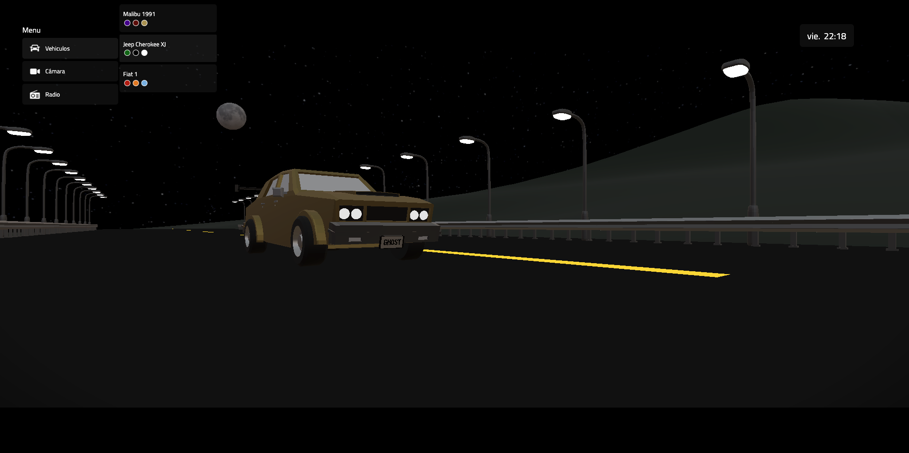
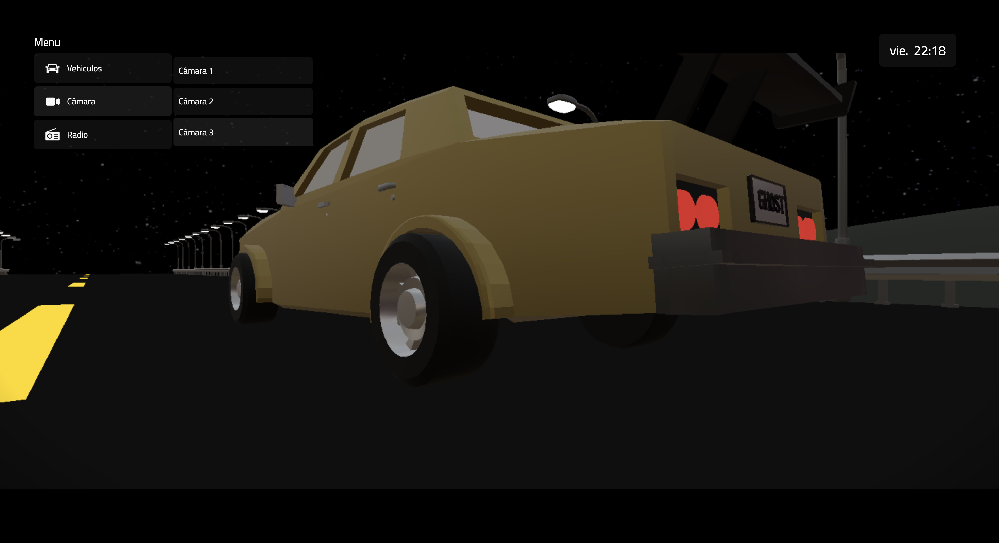
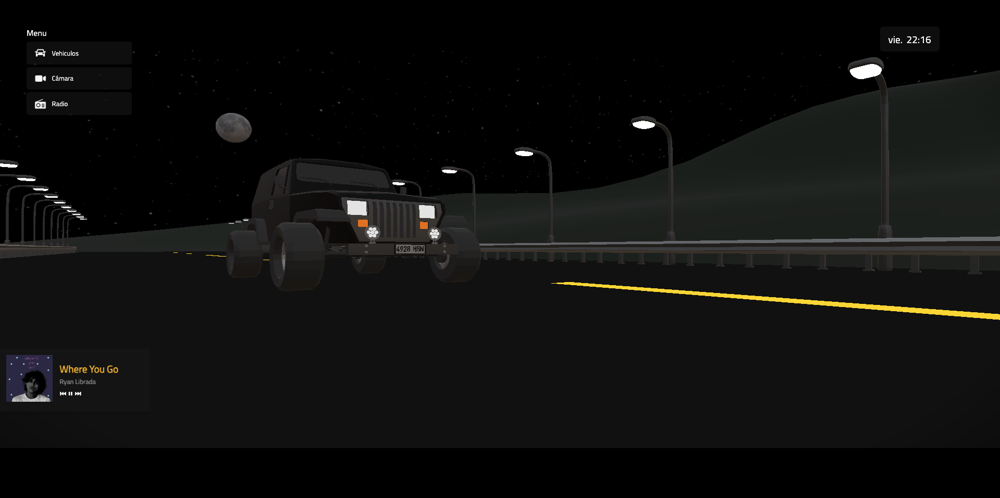
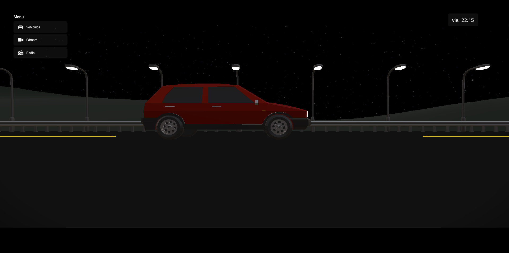
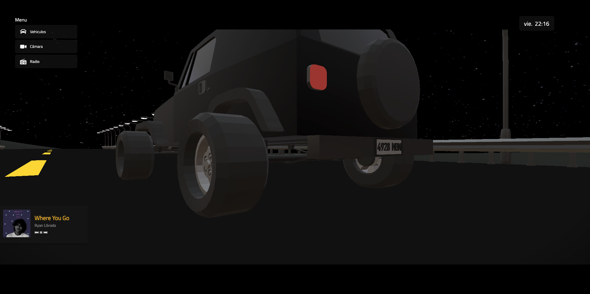

# Previsualizador de autos 3D

Un previsualizador 3D interactivo que permite personalizar diferentes tipos de autos y explorarlos desde múltiples ángulos y puntos de vista. Además, cuenta con una función de radio integrada que permite escuchar música mientras navegas e interactúas con la página.

# Imágenes del proyecto: 

---

---

---

---

---